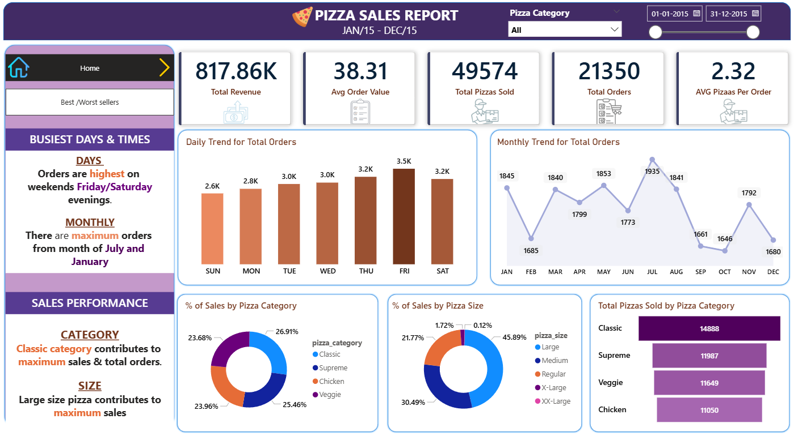
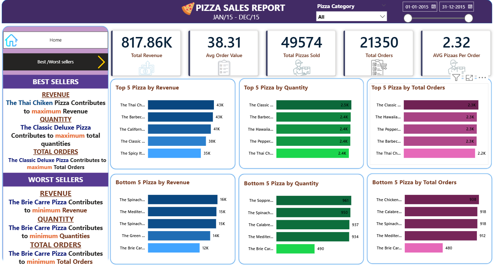
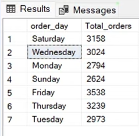
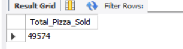
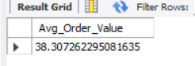
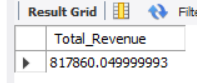
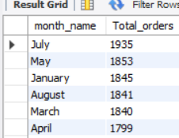
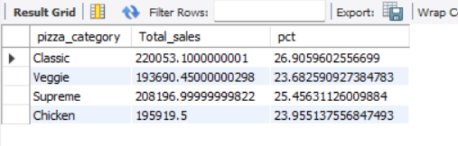

# pizza-sales-analysis_
This project demonstrates the ability to: - Perform end-to-end data analysis   - Extract meaningful insights from raw data   - Build interactive dashboards   - Apply business thinking to solve real-world problems  

## 🍕 Pizza Sales Analysis (SQL + Power BI)

## Project Overview
This project analyzes pizza sales data to uncover business insights such as revenue trends, best-selling pizzas, and customer ordering behavior.

## 🎯 Objective
To analyze sales performance and provide actionable insights to improve revenue and operations.

## Tools & Technologies
- SQL (Data Analysis)
- Power BI (Dashboard & Visualization)
- Data Cleaning

## 🧹 Data Cleaning
- Handled missing/null values
- Ensured data consistency
- Formatted date and time fields for analysis

## 📊 Key Analysis Performed
- Total Revenue Calculation  
- Total Orders & Quantity Sold  
- Sales by Category & Size  
- Peak Order Time Analysis  
- Top & Bottom Selling Pizzas  

## 📈 Key Insights
- Certain pizza categories generate higher revenue  
- Peak sales occur during specific hours (lunch/dinner)  
- Few pizzas contribute most of the revenue (Pareto principle)  
- Seasonal and daily trends impact sales  

## 🚨 Issues Identified
- Uneven sales distribution across products  
- Low-performing pizzas affecting inventory  
- Peak-time pressure on operations  

## 💡 Recommendations
- Focus on top-selling pizzas  
- Remove or improve low-performing items  
- Optimize staffing during peak hours  
- Introduce combo offers or promotions  

## 📊 Dashboards Preview

  

  

## 📂 Files in Repository
- `sql_queries.sql` → SQL queries used  
- `pizzasale.pbix` → Power BI dashboard  
- `pizza_sales.csv` → Raw dataset
- `Bussiness Requirement Document` -> Analysis report 

## 📈 Outcome
This project provides data-driven insights to improve sales strategy and business performance.

## 📊 Pizza Sales Analysis - SQL Outputs

This section presents key insights derived from SQL queries performed on the pizza sales dataset. The analysis helps understand sales trends, customer behavior, and overall business performance.

## 📅 Orders by Day of the Week

This analysis shows the number of orders placed on each day of the week.

**Insights:**

* Highest orders are recorded on **Friday (3538 orders)** and **Thursday (3239 orders)**.
* Weekends like **Saturday (3158)** and **Sunday (2624)** also show strong sales.
* **Monday (2794)** and **Tuesday (2973)** have comparatively lower orders.

## 🍕 Total Pizza Sold

This metric represents the total number of pizzas sold.

**Insight:**

* A total of **49,574 pizzas** were sold, indicating strong overall demand.
  
## 💰 Average Order Value

This shows the average amount spent per order.

**Insight:**

* The average order value is approximately **38.31**, which helps in understanding customer spending behavior.

## 💵 Total Revenue

This represents the total revenue generated from all pizza sales.

**Insight:**

* Total revenue generated is approximately **817,860**, showing the overall business performance.

## 📅 Monthly Sales Analysis
- Identified total orders by month  
- Observed variations in demand across months

  
  
## 📆 Day-wise Sales Analysis
- Analyzed total orders by day of the week  
- Identified peak and low-performing days
- 
  
  
## 🍕 Category-wise Sales Analysis
- Calculated total sales by pizza category  
- Derived percentage contribution of each category 

  
  
## 🚀 Conclusion

The analysis highlights that:

* Sales peak towards the **end of the week**.
* The business has strong revenue generation and consistent customer demand.
* These insights can help in **inventory planning, staffing, and marketing strategies**.
